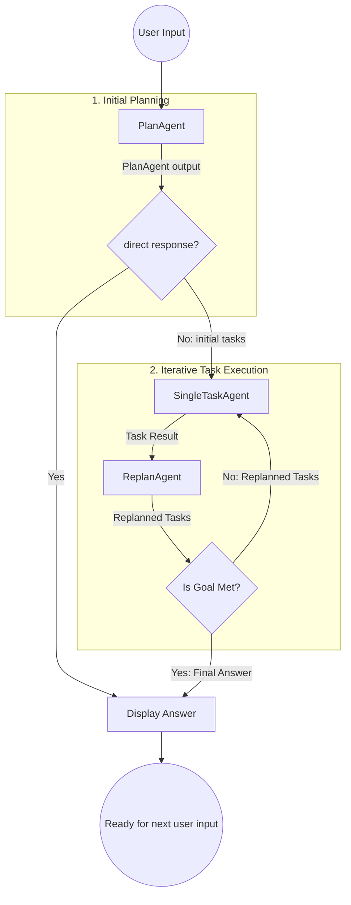
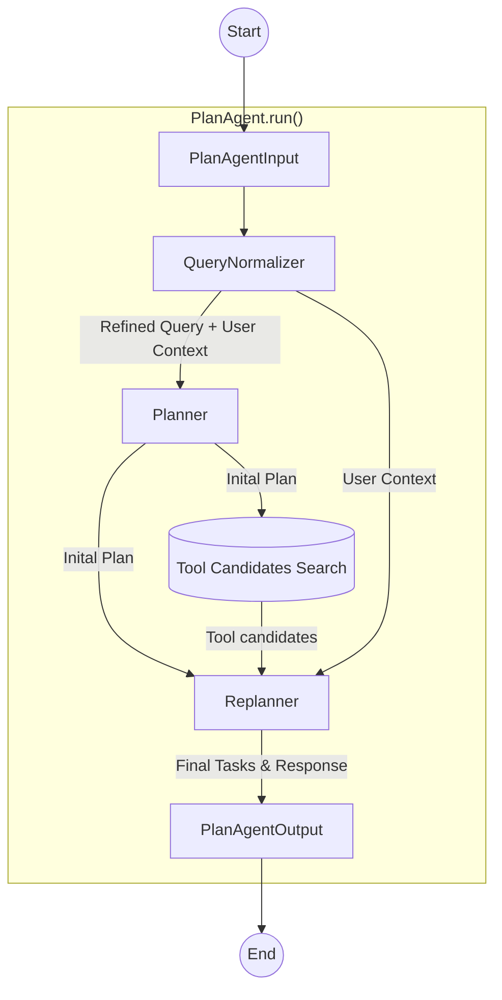
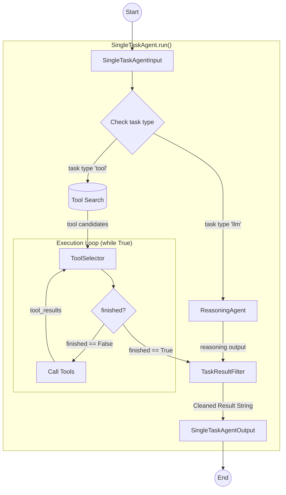
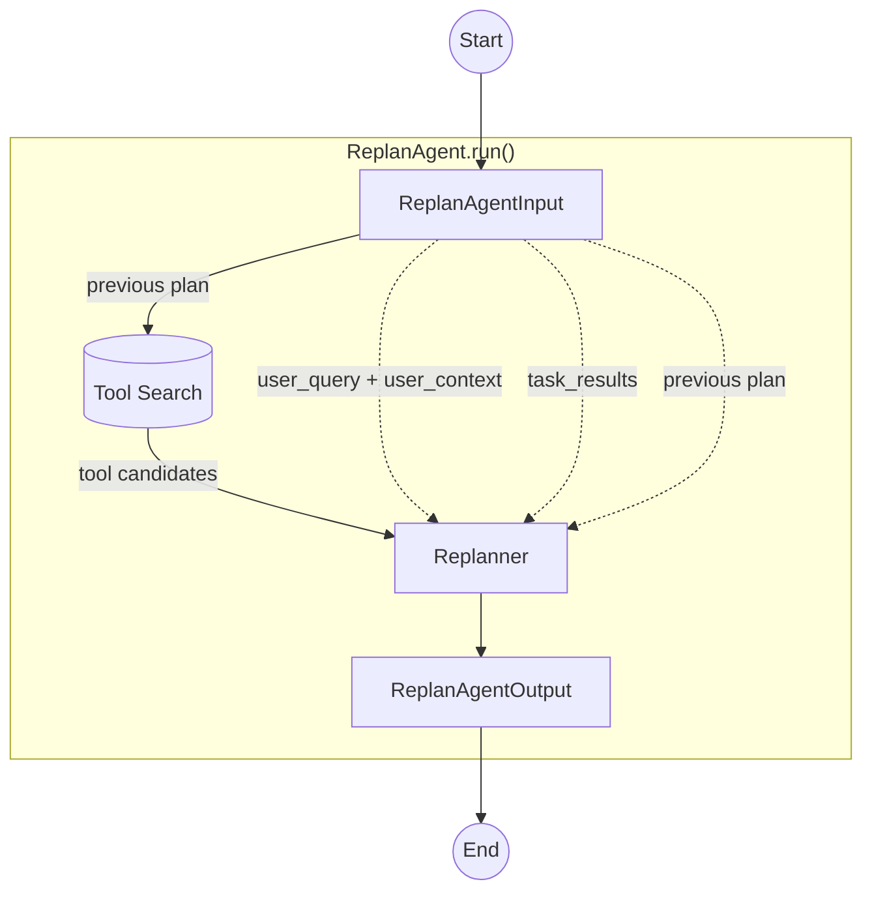

# easylocai-cli
- very simple automatic AI agent for your local machine 

# Requirements
- Only working for MacOS
- Python 3.12+
- Ollama and gpt-oss:20b model should be installed  

# Install & Execution 
## Installation
```bash
bash install.sh
````

## Configuration

### MCP server configuration
- file_name: `~/.config/easylocai/config.json`
- example
    ```json
    {
      "mcpServers": {
        "filesystem": {
          "command": "npx",
          "args": [
            "-y",
            "@modelcontextprotocol/server-filesystem",
            "."
          ]
        },
        "kubernetes": {
          "command": "python",
          "args": [
            "-m",
            "kubectl_mcp_tool.mcp_server"
          ],
          "cwd": "~/Programming/kubectl-mcp-server",
          "env": {
            "KUBECONFIG": "~/.kube/config",
            "KUBECTL_MCP_LOG_LEVEL": "ERROR",
            "PYTHONUNBUFFERED": "1"
          }
        },
        "notion_api": {
          "command": "docker",
          "args": [
            "run",
            "--rm",
            "-i",
            "-e", "NOTION_TOKEN",
            "mcp/notion"
          ],
          "env": {
            "NOTION_TOKEN": "<token>"
          }
        }
      }
    }
    ```

## Initialization
```bash
easylocai init
```

If you want to force re-initialization, use `--force` flag:
```bash
easylocai init --force
```

## Run
```bash
easylocai
```


# Architecture

The system is built on a **Modular Agentic Workflow** following a "Plan-Execute-Replan" cycle. Unlike static chain-of-thought systems, this architecture allows the AI to dynamically pivot its strategy based on real-time tool outputs and execution results.

## Core Components

| Component | Responsibility | Key Input |
| :--- | :--- | :--- |
| **PlanAgent** | Analyzes the user query and generates a high-level roadmap of tasks. | User Query, History |
| **SingleTaskAgent** | The "Worker" agent. Executes a specific task via LLM reasoning or iterative tool-calling. | Single Task, Tools |
| **ReplanAgent** | The "Supervisor." Evaluates task results to decide if the goal is met or if the plan needs a pivot. | Task Results, Previous Plan |
| **ServerManager** | Manages the lifecycle and execution of external tools (MCP/Servers). | Config File, Tool Schema |
| **ChromaDB** | Acts as a Vector Store for Tool Discovery (RAG for tools). | Task Descriptions |

---

## System Workflow

The coordination between agents is managed in a dynamic loop that ensures high reliability and adaptive problem-solving.

### Agentic Workflow Diagram



### Workflow in Agents
#### PlanAgent



#### SingleTaskAgent



#### ReplanAgent


