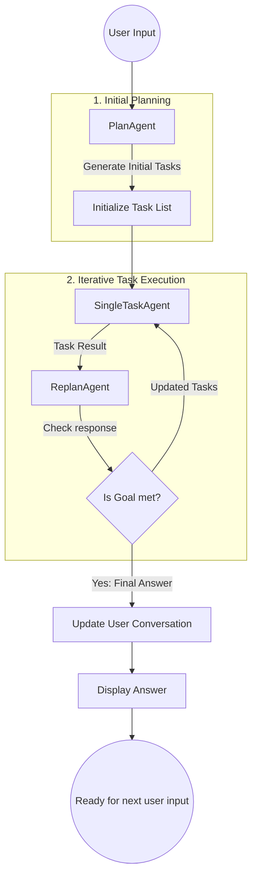
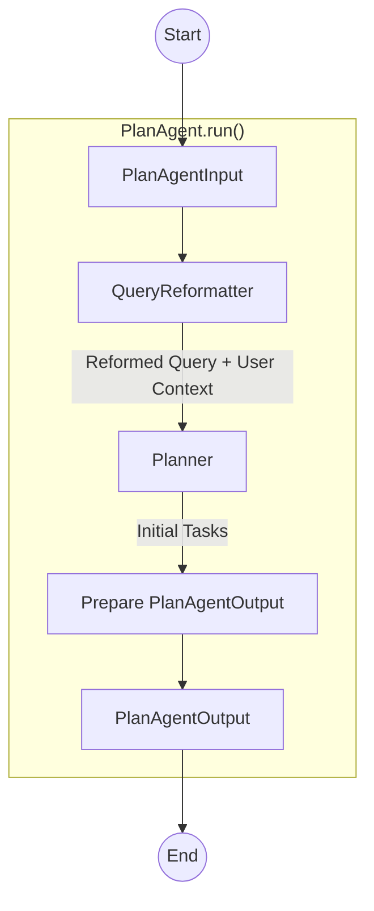
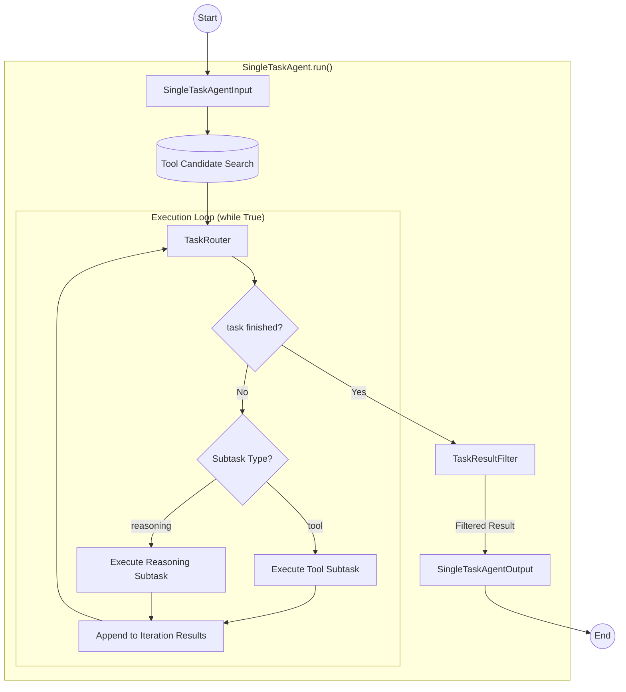
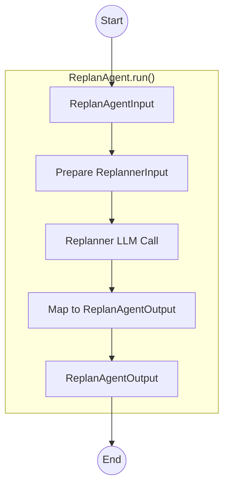

# Architecture

The system is built on a **Modular Agentic Workflow** following a "Plan-Execute-Replan" cycle. Unlike static chain-of-thought systems, this architecture allows the AI to dynamically pivot its strategy based on real-time tool outputs and execution results.

## Core Components

| Component           | Responsibility                                                                                      | Key Input |
|:--------------------|:----------------------------------------------------------------------------------------------------| :--- |
| **PlanAgent**       | Analyzes the user query and generates a high-level roadmap of tasks.                                | User Query, History |
| **SingleTaskAgent** | The "Worker" agent. Executes a specific task via LLM reasoning or iterative tool-calling.           | Single Task, Tools |
| **ReplanAgent**     | The "Supervisor." Evaluates task results to decide if the goal is met or if the plan needs a pivot. | Task Results, Previous Plan |
| **ToolManager**     | Manages the lifecycle and execution of external mcp tools.                                          | Config File, Tool Schema |
---

## System Workflow

The coordination between agents is managed in a dynamic loop that ensures high reliability and adaptive problem-solving.

### Agentic Workflow Diagram



### Workflow in Agents
#### PlanAgent
The PlanAgent acts as the intake manifold. It uses a QueryReformatter to de-reference pronouns (e.g., "it," "that") and inject historical context before the Planner breaks the query into a list of discrete strings.



#### SingleTaskAgent
The SingleTaskAgent is to complete the given task using tools or a reasoning agent. It utilizes a TaskRouter to decide on a step-by-step basis whether to call a tool or use pure reasoning. This loop continues until the Router determines the specific task is complete.



#### ReplanAgent
The ReplanAgent is the exit logic for the system. It inspects the task_results accumulated so far. If it can provide a final response, the workflow ends. Otherwise, it generates a new set of tasks to continue the loop.

---

## Workflow Variants

Run a specific variant with `--flag=<name>` (e.g. `easylocai --flag=contextimprove`). Variants are registered in `easylocai/main.py`.

### `contextimprove` variant (`--flag=contextimprove`)

Introduces a hierarchical **Context** object layer that unifies data flow across the Plan-Execute-Replan loop. The existing `main` workflow is unchanged.

**Files:**
- `easylocai/schemas/context.py` — Context schema definitions
- `easylocai/workflow_contextimprove.py` — `EasylocaiWorkflowContextImprove`
- `easylocai/main_contextimprove.py` — Runner function
- `easylocai/agents/plan_agent_contextimprove.py` — Context-aware PlanAgent
- `easylocai/agents/single_task_agent_contextimprove.py` — Context-aware SingleTaskAgent
- `easylocai/agents/replan_agent_contextimprove.py` — Context-aware ReplanAgent

#### Context Hierarchy

Three independent flat Pydantic models (no class inheritance or composition):

| Context | Owner | Scope |
|:--------|:------|:------|
| `GlobalContext` | `main_contextimprove.py` | Persists across conversations; holds `conversation_histories` |
| `WorkflowContext` | `EasylocaiWorkflowContextImprove` | Single user query lifecycle; updated by the workflow |
| `SingleTaskAgentContext` | `SingleTaskAgent` internally | Single task execution; includes all WorkflowContext fields plus agent-internal fields |

**Design principle:** Each context is updated only by its owner. Agents return result data; they do not mutate caller-owned contexts.

#### Data Flow

```
main_contextimprove.py
  GlobalContext()
    └─ workflow.run(user_query, global_context)
         ├─ WorkflowContext(original_user_query, conversation_histories from global_context)
         ├─ PlanAgentContextImprove → fills query_context, reformatted_user_query, task_list
         ├─ [loop]
         │    ├─ SingleTaskAgentContext(all WorkflowContext fields + original_task)
         │    ├─ SingleTaskAgentContextImprove → returns (executed_task, result)
         │    ├─ WorkflowContext.executed_task_results.append(...)
         │    └─ ReplanAgentContextImprove → updates task_list or returns final response
         └─ GlobalContext.conversation_histories.append(ConversationHistory(...))
```



