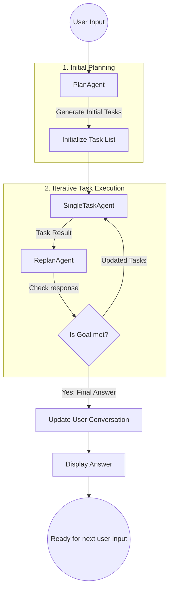
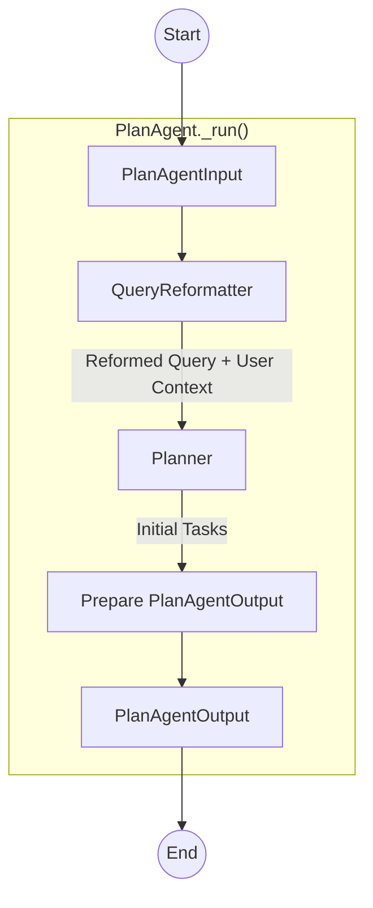
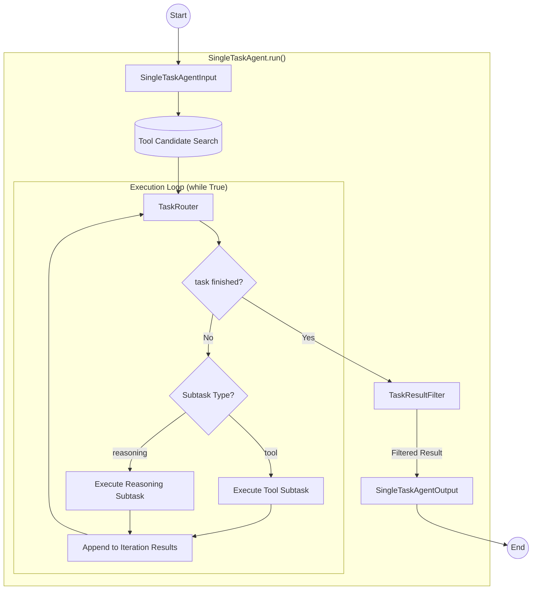
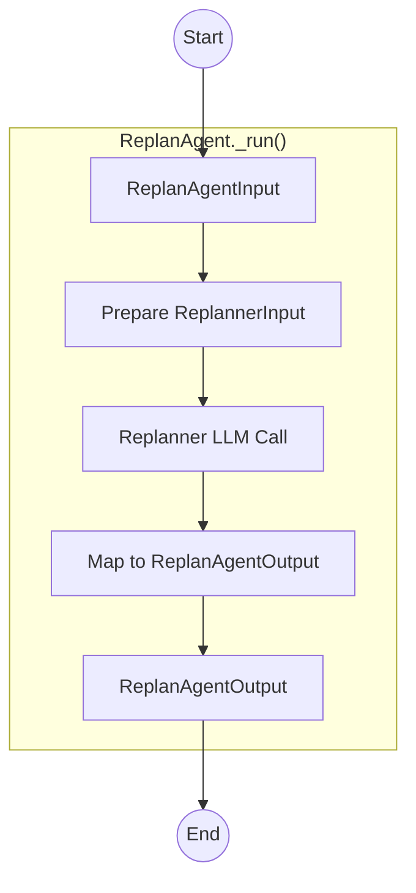

# Architecture

The system is built on a **Modular Agentic Workflow** following a "Plan-Execute-Replan" cycle. Unlike static chain-of-thought systems, this architecture allows the AI to dynamically pivot its strategy based on real-time tool outputs and execution results.

## Core Components

| Component           | Responsibility                                                                                      | Key Input |
|:--------------------|:----------------------------------------------------------------------------------------------------| :--- |
| **PlanAgent**       | Analyzes the user query and generates a high-level roadmap of tasks.                                | User Query, History |
| **SingleTaskAgent** | The "Worker" agent. Executes a specific task via LLM reasoning or iterative tool-calling.           | Single Task, Tools |
| **ReplanAgent**     | The "Supervisor." Evaluates task results to decide if the goal is met or if the plan needs a pivot. | Task Results, Previous Plan |
| **ToolManager**     | Manages the lifecycle and execution of external mcp tools.                                          | Config File, Tool Schema |
---

## System Workflow

The coordination between agents is managed in a dynamic loop that ensures high reliability and adaptive problem-solving.

### Agentic Workflow Diagram

### Workflow in Agents
#### PlanAgent

#### SingleTaskAgent

#### ReplanAgent

